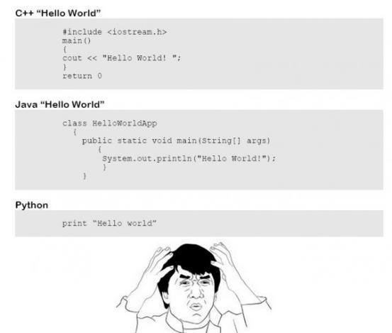

# HelloWorlder
A very specialized programming language that only prints "Hello World!"

## Installation

```bash
$ cd build
$ ../configure
$ make
$ sudo make install
```

## Usage

A HelloWorlder program can just and only print "Hello World!". So the language was optimized for this task: there are *no* statements, commands or even comments. Anything beyond an empty source file is considered a syntax error.

So this is how you create and run your first HelloWorlder program:

```bash
$ touch my-first-hello-worlder
$ helloworlder my-first-hello-worlder
Hello World!
$
```

Are there other languages whose recommended editor is `touch`?

But it does not stop there. You can use *no editor*:

```bash
$ helloworlder never-written-hello-worlder-source-file
Hello World!
$
```

or even:

```bash
$ helloworlder /dev/null
Hello World!
$
```

Notice the interpreter is very strict about syntax:

```bash
$ helloworlder /dev/random 
Syntax error: Unexpected statement
$
```

## Uninstalling

```bash
$ cd build
$ sudo make uninstall
```

# But... Why?!

Because I stumbled upon this bad meme attempt (yeah, there are syntax errors):



Apparently claiming that we should evaluate languages on how verbose is "Hello World!" on them.

Well then... now you have the least verbose language, that **ONLY** prints "Hello World!"!
